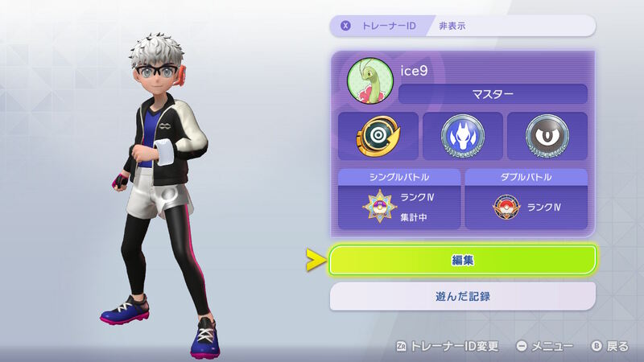
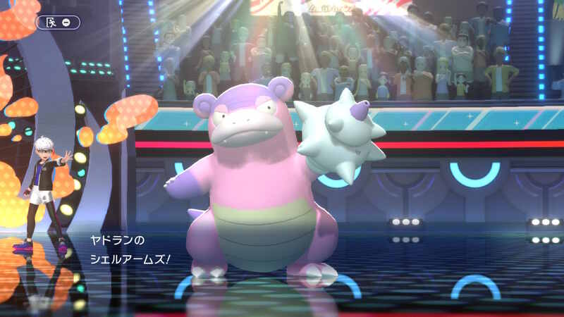
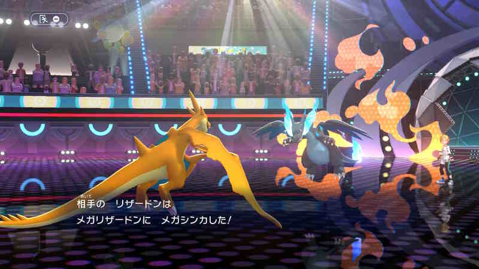

## Pokémon Champions ついにマスターボール級へ

先日ファーストインプレッションを書いた『ポケモンチャンピオンズ』だが、その後も空き時間にポチポチと進めていた。そして先日、ついに無課金でマスターボール級に昇格した。

正直、上がるまではかなりの紆余曲折があった。このゲーム特有のスピーディーな仕様に助けられつつ、対戦特化型としての面白さを再確認した数日間を振り返る。

## 爆速の育成とバトルの手触り

改めて感じるのは、育成のハードルが極限まで低いことの快適さだ。厳選なしで即ランクマッチに潜れる仕様は、今の時代に合っている。バトル中の降参もスムーズで、ストレスなく次へ行ける。

ポケモンの内定数も絶妙だ。多すぎず少なすぎず、好きなポケモンを軸にしつつ、環境のテンプレ個体も把握しやすい。この手触りの良さは対戦ツールとして最高だと思う。

## 最初の壁：モンスターボール級Ⅳの衝撃

最初はダブルバトルを触っていたが、途中からシングル戦に集中することにした。そこでぶつかったのが、実質的なスタート地点であるモンスターボール級Ⅳだ。

ここがとにかく勝てなかった。実はここからⅢに上がるまで非常に苦労した。何せ、勝てない。勝手がわからないながらタイプ相性はきちんとゲーム側でこうかなし、いまひとつ、こうかあり、こうかばつぐん、超効果抜群と表示してくれる。ポケモン自体の特徴もなんとなく把握はしていた。が、勝てない。この時点ではまだ自分がマスターボール級に上がれるとは思っていなかった。

## メガリザードンYという相棒

そこから段々と慣れてきたのか遂にモンスターボール級に到達。そこからは驚くほど勝てるようになってきた。その立役者の一人がリザードンをメガシンカさせたメガリザードンYだ。彼はメガシンカすることで高火力の攻撃をそれなりの速度で撃つことができるようになる。

彼の強さを活かす形で序盤はパーティを組んだ。苦手でない相手にはまず彼の高火力で牽制して削ることに終始した。また、速度の遅い水タイプにはメガシンカでひでりからのターン待ち無しのソーラービームで対応した。かえんほうしゃの安定性に天敵対策のソーラービーム、幅を増やす飛行タイプのエアスラッシュに4枠目の技は気分で付け替えた。

彼を主軸にまずはタイプ相性で押したり控えのたすきやこだわりスカーフなどを持たせたドラゴンタイプ、そしてそれを保管する草や水タイプのポケモンを選んだ。これでスーパーボール級を突破。なんとかコンボを組まずにタイプを選ぶのみでハイパーに上がれた。

## 第二の関門：ハイパーボール級の「ガチ勢」

ここからが第二の関門、そう、ハイパーボール級Ⅳから上がれない。わかってはいたが、ここからしっかりとパーティを組んだり、コンボを入れたり、確実に高火力を通してくる舞型やとにかく耐久を盛る型など「勝ちにくる」プレイヤーが増えてきた。

最初は無限に思えたVPも段々枯渇してきて気軽にスカウトやメガストーンを買うこともできなくなってきた。序盤わりと好きなポケモンをスカウトしてきたせいかいわゆるテンプレとされるポケモンがいなかったので。そこでコンボの構築は諦め、今まで通り汎用性を活かしたパーティーでシンプルに戦うことにした。

## 救世主・ガラルヤドンの投入

ここで目をつけたのが、ガラルヤドンにせんせいの爪をもたせ、特性のクイックドローで先制攻撃を浴びせる戦法だ。技構成は以下の通り：

* **シェルアームズ**：草とフェアリーを狙い撃ち
* **サイコキネシス**：ミミロップとドヒトイデ対策
* **パワージェム**：リザードンYやほのお、ひこうへの対策
* **れいとうビーム**：ドラゴンタイプへの攻撃

そこそこの確率で先制でき、広範囲のポケモンに互角の戦いを挑める。使用率の高いポケモン達への汎用対策も盛り込んだ。一点突破ではないがゆえに先手で削っていく方策をとったのだ。

これによりⅢに上がった。さらにそこから流行っているマスカーニャや強いミミロップ、耐久のカビゴン、水フェアリーのアシレーヌなどを育成せず牽制だけに使用した。これにより育成してなくても相手を惑わせ、選出でこちらに対策させる道を選んだのだ。

こちらは入れ替えながら、リザードンYや秘策のからやぶりカメックスで相手が準備してる間に先制をとり残った相手をガラルヤドンやドラゴンタイプで殲滅するという戦法。これによりなんとかかんとかコンボなどを組まずに対応力で勝負できるようになった。

ついにマスターボール級に到達。ラストバトルで相手のイダイトウの攻撃に耐え、相手を2体抜いたリザードンYはやはり王者の風格だった。この瞬間の興奮はこのゲームをやっていてよかったと思う瞬間であった。

かくして目標だったマスターボールⅣ級に到達した。15日にきたるチャンピオン級の解禁までは級として最初期の最上位なので満足することにする（笑）



## 苦しめられたトラウマポケモンたち

昇格までに苦戦したポケモン、つまりトラウマをまとめたい。

* **モンスターボール級**：各メガシンカポケモン
* **スーパーボール級**：カバルドン、メガカイリュー、マスカーニャ、ゲッコウガ
* **ハイパーボール級**：メガハッサム、メガミミロップ、ヒスイヌメルゴン、ドヒトイデ

この辺り。大体のポケモンには汎用作で対応できるようになってきたが、メガハッサムだけはまだ対応策が個人的には見つかっていないので要検証していきたい。

## まとめ：これぞポケモン対戦の醍醐味

楽しかったこと：
全く勝てないところから脳が学習したのか勝てるようになっていく。新しい戦術を考え、構築する瞬間。時間や級によって移り変わる流行りのポケモン。段々と集められ充実していく戦力。この辺りはとても楽しかった。

とにかくこんなゲームが無料でいいのかと思うほど楽しませてもらったゲームだ。これからお布施課金をしたいと思う。